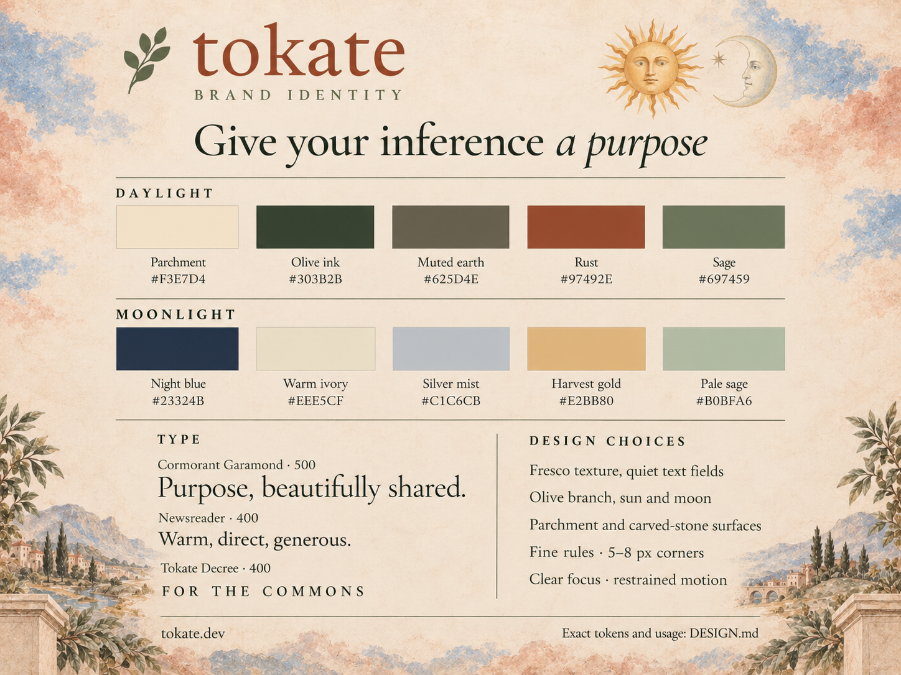

## Overview

Tokate feels human, generous and deliberate: Renaissance fresco, warm plaster,
olive foliage, painted sun and moon, and the quiet clarity of a well-set book.
The artwork invites participation. The interface makes the next action clear.

Use **Tokate** in prose and the lowercase **tokate** wordmark in Newsreader with
the olive sprig. Preserve the existing [mark](site/assets/mark.svg). The brand
line is **Give your inference a purpose**. Write warmly and directly, without
mock-archaic language or inflated claims. Reserve italic emphasis for a short
phrase, as in *a purpose*.

Based on [tokate.dev](https://tokate.dev/) and its [stylesheet](site/style.css),
using the [DESIGN.md format](https://github.com/google-labs-code/design.md/blob/main/docs/spec.md).
The tokens and bundled fonts are authoritative. The card is a visual reference.

## Colors

| Role | Daylight | Moonlight |
| --- | --- | --- |
| Background | Parchment `#F3E7D4` | Night blue `#23324B` |
| Main text | Olive ink `#303B2B` | Warm ivory `#EEE5CF` |
| Supporting text | Muted earth `#625D4E` | Silver mist `#C1C6CB` |
| Accent and focus | Rust `#97492E` | Harvest gold `#E2BB80` |
| Botanical detail | Sage `#697459` | Pale sage `#B0BFA6` |

Let parchment or night blue dominate. Use olive/ivory for information and small
rust/gold accents for emphasis and interaction. Fresco blues, peach clouds and
sun gold belong to the artwork, not additional UI accent palettes. Fine rules
use the translucent `line` tokens. Inputs use the pale `surface` token.

On flat daylight parchment, olive ink is 9.63:1, muted earth 5.38:1 and rust
5.20:1. Sage is 4.05:1, so keep it for ornaments or large text, not small labels.
Moonlight text pairs exceed 4.5:1. Check contrast against the actual rendered
background: put readable text on a quiet opaque surface when the painting varies.

## Typography

- **Cormorant Garamond Medium, 500:** headlines, section titles and prominent
  actions. The site registers it as `Cormorant`. Use its real italic face for
  brief emphasis. Large display type may be tightly set, body copy may not.
- **Newsreader Regular, 400:** wordmark, body, navigation and labels. Use the
  bundled italic for short editorial emphasis. Keep ordinary copy in sentence case.
- **Tokate Decree, 400:** occasional ceremonial headings and Roman numerals.
  The site registers it as `Decree`. Keep it out of paragraphs and dense controls.

Use the existing WOFF2 files in [site/assets](site/assets/) and retain the
[Cormorant](site/assets/Cormorant-LICENSE.txt),
[Newsreader](site/assets/Newsreader-LICENSE.txt) and
[Cinzel/Decree](site/assets/Cinzel-LICENSE.txt) notices. Georgia/serif is the
fallback. Use native monospace for code and terminal output. Do not add a font
merely for a new page or use the unused source fonts as new brand faces.

The token sizes describe the site's hierarchy. Scale display type fluidly and
check wrapping at narrow widths. Keep body copy around 18px and comfortably
spaced. Longer documents can increase line height without enlarging every heading.

## Layout

Use generous margins and a clear reading order. Center a short promotional hero,
then left-align explanatory content. The site uses a 1400px header limit and
1050px content limit, with a 24px gutter. Use the spacing scale for new work,
allowing small optical adjustments around illustrations.

Keep one focal illustration per composition. Frame it with pale clouds,
landscape or botanical edges and leave quiet space for text. Related choices
may sit side by side, then stack on narrow screens. Avoid clipping labels or
shrinking text to preserve a desktop layout.

## Elevation & Depth

Create depth with matte plaster, parchment, carved stone and fine tonal rules.
Use broad flat surfaces for forms and dense information. The site's stone
buttons have only a small soft hover shadow. Reserve stronger shadows for
overlays, never for every row or panel. Avoid glass, glossy gradients and neon glow.

## Shapes

Use restrained 5px to 8px corners for controls and panels. Circles belong to
celestial artwork and compact icon controls. Olive sprigs, laurel numerals and
scroll edges are accents, not borders around every component.

## Components

- **Identity and artwork:** reuse the olive mark and existing painted assets
  from [site/assets](site/assets/). Original PNGs live in
  [branding/artwork](branding/artwork/). Hands offering the sun express donation.
  The moon supports the darker theme. Preserve proportions and breathing room.
- **Actions:** use the existing stone artwork for spacious promotional choices.
  Use the flat button tokens for denser interfaces. Keep labels short and clear,
  with at least a 44px target. Do not bake functional labels into artwork.
- **Links and focus:** underline inline links or make their purpose otherwise
  unambiguous. Use a visible 2px rust/gold focus outline with space around it.
  Do not communicate status through color alone.
- **Inputs and instructions:** use calm readable surfaces, persistent labels
  and nearby explanations. The painted scroll is an occasional presentation
  device, not a required container for every form.
- **Motion:** small hover changes around 200ms, with at most a 2px lift.
  Celestial/theme transitions may be slower, around 650ms to 750ms. Respect
  reduced motion and provide a pause control for ongoing decorative animation.
- **New formats:** carry the palette, hierarchy and voice into tools, documents
  and social artwork. Keep dense data and terminal workflows clear and mostly
  flat. Brand recognition does not require repeating the entire landing page.

## Do's and Don'ts

- Do protect empty space, readable type and clear actions before adding ornament.
- Do use soft, worn fresco texture around content and restrained botanical detail.
- Do preserve readable light and dark treatments and keyboard focus.
- Don't put small text on busy paint, make every panel a scroll, or add competing motifs.
- Don't introduce unrelated fonts, bright synthetic accents, pill-heavy chrome or glossy effects.
- Don't imply that decorative polish proves a workflow or verification succeeded.
