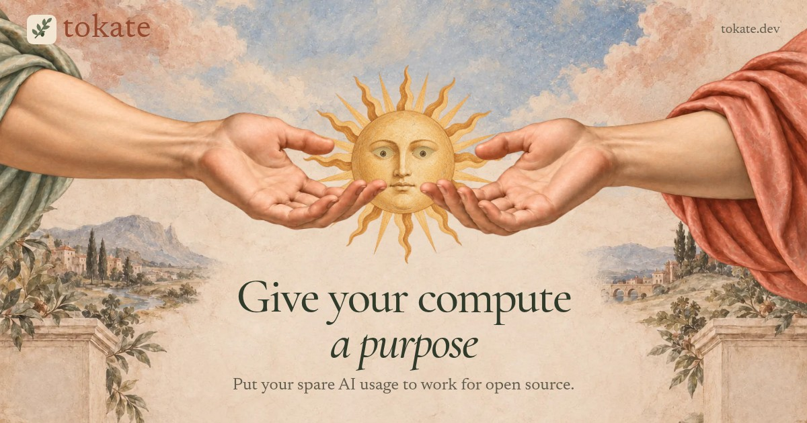

[](https://tokate.dev/)

# Tokate

**toh-KAH-teh**. Put your spare AI usage to work for open source.

An owner approves an issue. A donor runs it with their own accounts. Tokate checks the result and opens a draft PR for owner review.

## Get started with your AI

Give your coding assistant this prompt:

> Read https://raw.githubusercontent.com/obselate/tokate/main/AGENTS.md and help me set up Tokate. Establish whether I am an owner or donor, then guide me through the next step.

## Install

```sh
curl -qfsSL https://tokate.dev/install.sh | sh
```

Installs for your user and sets up PATH. Open a new terminal if prompted.
Update with `tokate update`. Remove with `tokate uninstall`, which keeps saved work.

The binary requires **Linux x86_64 with glibc 2.34+** and public GitHub repositories. The initial observed systems are Ubuntu 24.04 x86_64 CI and a CachyOS rolling x86_64 host; the glibc minimum does not establish support for every distribution. ARM64, musl, Windows, and macOS are not supported. Managed Codex execution requires a ChatGPT login and supports user-local native binaries and npm installations. Owners can explicitly opt into [version-2 coordination and external coding tools](docs/coordination-v2.md); default version-1 setup is unchanged. See the [support limits](docs/reference.md#install-and-check-support).

## For Owners:

1. Check owner tools with `tokate doctor --owner --auth`, sign in with `gh auth login` if needed, and run `tokate init` in your repository.
2. Set the project's checks and allowed model/effort pairs, then commit the generated files. Optionally add root [DECREE.md codebase instructions](docs/reference.md#owner-codebase-instructions). Your AI can follow the [owner setup guide](AGENTS.md#guide-a-repository-owner).
3. Write an issue with clear acceptance criteria and approve a donor:

```sh
tokate approve --repo OWNER/REPO --issue 42 --donor DONOR
```

Review the resulting PR and [required checks](docs/reference.md#review-and-accept), then merge when satisfied.

## For Donors:

1. Follow the [donor setup guide](AGENTS.md#guide-a-donor) to sign in and check your tools with `tokate doctor`.
2. Get assigned to an approved issue. Tokate discovers or creates your fork; use `--fork DONOR/NAME` for an explicit selection.
3. Choose an allowed model/effort pair and start:

```sh
tokate work --repo OWNER/REPO --issue 42 --model MODEL --effort EFFORT
```

Tokate prepares the checkout, runs the task and checks, then opens a draft PR. Your accounts and AI usage stay under your control.

For assistants, every command accepts explicit `--json`; `tokate help --json` lists
arguments and effects. See the [versioned output contract](docs/reference.md#automate-commands).

Use `tokate work --help`, `tokate help work` or `-h` for focused command help.
You can pass an issue URL directly, or omit `--repo` when local remotes identify
one GitHub repository. [Shell completion and input rules](docs/reference.md#find-a-command) cover Bash, Zsh and Fish.

[Website](https://tokate.dev/) · [Releases](https://github.com/obselate/tokate/releases) · [Commands and recovery](docs/reference.md) · [Data transparency](docs/transparency.md) · [Build from source](docs/reference.md#build-and-verify-from-source) · [Issues](https://github.com/obselate/tokate/issues) · [MIT license](LICENSE)
